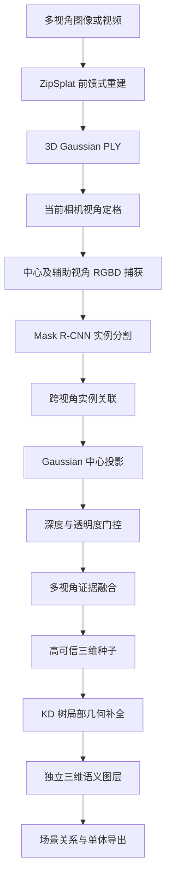

# 面向三维高斯场景的多视角语义投射、几何补全与对象级编辑

## 论文初期研究报告

## 1. 选题概述

### 1.1 拟定题目

中文题目：面向三维高斯场景的多视角语义投射、几何补全与对象级编辑

英文题目：Multi-view Semantic Projection, Geometric Completion, and Object-level Editing for 3D Gaussian Scenes

备选题目：

1. 基于深度约束多视角融合的 3D Gaussian 语义图层生成方法
2. 从二维实例掩码到三维高斯对象：投射、补全与交互编辑
3. 面向破损重建场景的三维高斯语义分割与对象图层构建

### 1.2 研究方向

本研究面向由少量未标定图像快速重建的 3D Gaussian Splatting 场景，研究如何把二维实例分割结果稳定映射为可编辑、可持久化的三维对象图层。核心问题不是提高基础重建模型本身的画质，而是解决重建完成后的对象级语义组织问题。

研究链路包括：少视图前馈式 3DGS 重建、当前相机视角定格、多视角 RGBD 语义证据获取、二维实例关联、深度门控 Gaussian 投射、局部几何补全、独立对象图层生成及视角相关场景关系分析。

## 2. 研究背景与意义

3D Gaussian Splatting 通过一组带位置、尺度、旋转、透明度和颜色特征的各向异性 Gaussian 表示三维场景，具有实时渲染和高视觉质量优势。ZipSplat 等前馈模型进一步降低了输入要求，可从少量未标定图片直接预测 Gaussian 场景，不依赖逐场景优化。

然而，快速重建得到的 Gaussian 集合通常缺少对象语义。用户可以观看场景，却难以直接完成以下任务：

1. 选择一个完整物体，而不是框选局部 Gaussian。
2. 将瓶子、杯子、椅子等对象从背景中剥离。
3. 对破损或被遮挡区域进行有限补全。
4. 将对象保存为独立图层并单独导出。
5. 分析对象间的视角相关空间关系。

二维实例分割能够获得高质量像素 mask，但直接将 mask 投影到三维会受到透明 Gaussian、遮挡、深度噪声、重建破损和多视角实例不一致影响。因此，研究二维语义证据向 3DGS 原语的可靠迁移，具有明确的方法价值和应用意义。

## 3. 国内外研究现状

### 3.1 三维场景表示与快速重建

NeRF 使用隐式神经场表达密度和颜色，具有良好新视角合成能力，但训练和渲染成本较高。3D Gaussian Splatting 使用显式 Gaussian 原语实现高质量实时渲染。ZipSplat 采用前馈网络从少量未标定图像直接输出紧凑 Gaussian 集合，为快速重建与在线编辑提供基础。

现有快速重建工作主要关注新视角合成质量、推理速度、Gaussian 数量和压缩率，对重建后对象级语义编辑关注不足。

### 3.2 二维实例分割

Mask R-CNN 将检测和像素级实例分割结合，可直接输出类别、边界框、置信度和实例 mask。SAM 及 SAM 2 提供强泛化的提示式分割能力，但其输出仍位于二维图像域。

本研究当前使用 COCO 预训练 Mask R-CNN 完成固定类别自动识别。SAM 2.1 Hiera Tiny 已完成代码接入，但尚未形成正式产品入口，因此不作为当前实验成果，仅作为后续交互修正方案。

### 3.3 二维语义到三维场景

常见路线包括像素深度反投影、点云语义融合、多视角投票和神经场特征蒸馏。对于 3DGS，直接反投影像素会生成大量冗余点，直接按 Gaussian 中心投影又容易受到遮挡和透明漂浮原语干扰。

本研究选择“Gaussian 中心投影＋深度可见性判断＋多视角证据融合”的主路线。该路线保持原始 Gaussian 拓扑，不创建新的点云副本，适合浏览器 GPU 并行执行，也便于直接接入编辑器选择状态。

### 3.4 三维区域生长与补全

Open3D 等点云工具常使用 KD 树、法向估计、聚类和区域生长处理局部几何。本研究借鉴该思路，但当前实现基于 NumPy 与 SciPy `cKDTree`，未直接依赖 Open3D。补全目标是恢复重建数据中已有但未被二维 mask 覆盖的 Gaussian，不是生成不存在的新几何。

## 4. 研究问题

论文拟回答以下问题：

1. 如何在用户当前相机视角下获取稳定且可复现的多视角 RGBD 语义证据？
2. 如何区分 mask 内真正可见的目标 Gaussian、前景漂浮 Gaussian、遮挡 Gaussian 和背景 Gaussian？
3. 如何关联不同视角中的同类实例，避免将两个瓶子错误合并？
4. 如何在不明显扩张到相邻物体的前提下补全破损或漏选区域？
5. 如何将融合结果转化为支持撤销、分层、持久化和导出的三维对象表示？

## 5. 研究目标

### 5.1 总体目标

提出并实现一套面向 3D Gaussian 场景的多视角语义图层生成方法，使二维实例 mask 能够在深度和局部几何约束下转化为稳定的三维 Gaussian 对象集合。

### 5.2 具体目标

1. 构建统一的多视角 RGB、深度和相机矩阵捕获接口。
2. 实现跨视角同类实例的一对一关联。
3. 实现基于 mask、深度、透明度和可见性的 GPU Gaussian 分类。
4. 实现受空间、颜色、尺度和法向约束的局部补全。
5. 支持对象图层分离、保存、重命名、删除和单体导出。
6. 建立二维与三维语义质量评价数据集和指标体系。

## 6. 总体技术路线

系统由 React/Vite 应用前端、FastAPI 推理后端和定制 SuperSplat 编辑器组成。基础重建由 ZipSplat 与 PyTorch/CUDA 完成。自动分割由 torchvision Mask R-CNN 完成。三维投射在浏览器 GPU 执行，精细补全在后端 CPU 使用 SciPy 完成。

## 7. 方法设计

### 7.1 三维 Gaussian 表示

设场景 Gaussian 集合为：

$$
\mathcal{G}=\{g_i\}_{i=1}^{N},\quad
g_i=(\boldsymbol{\mu}_i,\mathbf{R}_i,\mathbf{s}_i,\alpha_i,\mathbf{c}_i)
$$

其中，$\boldsymbol{\mu}_i\in\mathbb{R}^3$ 为中心，$\mathbf{R}_i$ 为旋转，$\mathbf{s}_i$ 为尺度，$\alpha_i$ 为透明度，$\mathbf{c}_i$ 为颜色或球谐特征。

论文目标是为目标实例 $o$ 估计二值标签：

$$
y_i^o\in\{0,1\}
$$

并得到对象 Gaussian 子集：

$$
\mathcal{G}_o=\{g_i\mid y_i^o=1\}
$$

### 7.2 多视角 RGBD 捕获

用户点击分割后固定主视角 $v_0$，并在主视角附近生成辅助视角 $v_1,v_2$。每个视角保存 RGB 图像 $I_v$、深度图 $D_v$、视图矩阵 $\mathbf{V}_v$、投影矩阵 $\mathbf{P}_v$、近平面、远平面和投影类型。

渲染每个视角前重新排序 Gaussian，保证透明混合顺序与视角一致。深度采用 Gaussian alpha 加权视深度，而不是直接读取普通硬件深度缓冲。

### 7.3 跨视角实例关联

Mask R-CNN 在每个视角产生实例集合 $\mathcal{M}_v$。主视角实例 $m_0^k$ 的有效深度像素被反投影到世界坐标，再投影到辅助视角。定义方向性重叠：

$$
O(m_0^k,m_v^j)=\frac{|\Pi_{0\rightarrow v}(m_0^k)\cap m_v^j|}{|\Pi_{0\rightarrow v}(m_0^k)|}
$$

仅在类别一致且 $O\geq\tau_o$ 时构造候选匹配，并按重叠度从高到低执行一对一贪心匹配。当前 $\tau_o=0.15$。三视角条件下，实例至少需要两个视角支持。

### 7.4 深度约束 Gaussian 投射

Gaussian 中心在视角 $v$ 中的齐次投影为：

$$
\tilde{\mathbf{p}}_{iv}=\mathbf{P}_v\mathbf{V}_v
\begin{bmatrix}
\boldsymbol{\mu}_i\\1
\end{bmatrix}
$$

透视除法后得到像素位置 $\mathbf{p}_{iv}$ 和相机深度 $z_{iv}$。若 $\mathbf{p}_{iv}$ 位于实例 mask 内，则获得二维命中证据。再将 $z_{iv}$ 与深度图 $D_v(\mathbf{p}_{iv})$ 比较：

$$
\Delta z_{iv}=z_{iv}-D_v(\mathbf{p}_{iv})
$$

依据自适应容差 $\tau_z$ 将 Gaussian 划分为：

1. $|\Delta z_{iv}|\leq\tau_z$：当前视角可见。
2. $\Delta z_{iv}< -\tau_z$：位于观测表面之前，可能是漂浮点或前景不一致。
3. $\Delta z_{iv}>\tau_z$：位于观测表面之后，视为遮挡未知，不直接记为负票。

同时过滤低透明度、已删除和已锁定 Gaussian。GPU 输出 mask 命中、深度有效、可见、前置不一致、后置不一致和低透明度状态位。

### 7.5 多视角融合

对 Gaussian $g_i$，设可见正票数为 $n_i^+$，可见负票数为 $n_i^-$，遮挡未知视图不参与分母。初始语义种子定义为：

$$
y_i^{seed}=\mathbb{I}(n_i^+\geq K \land n_i^-=0 \land \alpha_i\geq\tau_\alpha)
$$

当前三视角流程优先保留至少两个视角支持的核心区域；单视角证据只作为轮廓候选或回退种子。融合后只执行一次编辑历史提交，避免多次全量状态刷新。

### 7.6 局部几何补全

设高可信种子为 $S$，候选集为 $C$。使用 `cKDTree` 在 Gaussian 中心上构建局部邻接，并通过邻域协方差最小特征向量估计法向。候选 $g_j$ 被接纳需要同时满足：

$$
\|\boldsymbol{\mu}_j-\boldsymbol{\mu}_i\|_2<r_{ij}
$$

$$
\|\mathbf{c}_j-\mathbf{c}_i\|_2<\tau_c
$$

$$
\frac{\max(s_i,s_j)}{\min(s_i,s_j)}<\tau_s
$$

$$
|\mathbf{n}_i^T\mathbf{n}_j|>\tau_n
$$

当前实现还要求候选至少得到两个已接纳邻居支持，并限制最多增长为种子数量的 25%。该策略恢复局部漏选 Gaussian，同时抑制扩张到邻近对象。

### 7.7 对象图层与场景关系

融合结果通过 SuperSplat `SelectOp` 写入统一编辑历史，并可从原 Splat 分离为独立 Splat 图层。对象图层保存类别、二维 mask、相机参数、Gaussian 索引和源模型校验信息，可重命名、删除或单独导出为 PLY 等格式。

场景关系以用户定格视角为参考。对象中心使用坐标中位数，边界使用 5% 与 95% 分位数，以降低漂浮点影响。当前输出左、右、上、下、前、后、近邻和屏幕重叠等确定性关系。

## 8. 预期创新点

下列内容为拟验证贡献，正式论文中需要通过对比和消融实验支持：

1. 面向透明 3D Gaussian 的二维 mask、alpha 加权深度和多视角可见性联合投射方法。
2. 将遮挡定义为未知证据而非负证据的多视角 Gaussian 融合策略，降低破损场景下的误删。
3. 结合位置、颜色、尺度、透明度和局部法向的受限 Gaussian 区域生长方法。
4. 从语义检测到三维对象图层、持久化、撤销和单体导出的完整交互闭环。
5. 以用户相机为参考的稳健对象几何统计和空间关系表达。

其中第 4 点偏系统贡献，第 1 至第 3 点是论文方法贡献的主要候选。是否构成创新取决于与现有 3DGS 语义分割方法的系统文献对比和实验结果。

## 9. 当前系统实现

### 9.1 重建模块

使用 ZipSplat 从多视角图片生成 3DGS PLY。默认选择 6 个重建视图。对象模式通过透明度与 DBSCAN 清理背景，场景模式采用较保守的离群点清理。

### 9.2 语义识别模块

自动分割使用 Mask R-CNN ResNet50 FPN V2，检测阈值为 0.40。当前识别 19 类常见室内对象：杯子、椅子、瓶子、床、沙发、电视、笔记本电脑、键盘、鼠标、手机、书、盆栽、花瓶、时钟、冰箱、微波炉、烤箱、水槽和马桶。桌子按当前实验设置排除。

### 9.3 编辑器模块

基于 SuperSplat 和 PlayCanvas 实现多视角 RGBD 捕获、GPU 语义相交、三维补全、独立图层、图层持久化、快照及场景关系面板。浏览器端支持撤销和重做。

### 9.4 服务模块

FastAPI 提供上传、任务、结果、语义预测、三维精细补全、图层和场景快照接口。本地磁盘队列和单 Worker 限制 GPU 并发，重建任务在独立子进程中运行以释放显存。

## 10. 初步实验与结果

### 10.1 实验环境

当前验证环境：Windows 11、Python 3.13.3、Node.js 24.16.0、CUDA 12.8、PyTorch 2.11.0+cu128、NVIDIA GeForce RTX 4050 Laptop GPU，显存约 6.4 GB。

### 10.2 功能闭环实验

在任务 `c61e9bf8a2df` 的真实 3DGS PLY 上完成浏览器端到端冒烟测试。测试视口为 1280×800，语义捕获尺寸为 1280×767，包含 3 个相机视角。

| 阶段 | 结果 |
|---|---:|
| 初始 Gaussian 选择数 | 0 |
| 三维投射后选择数 | 1132 |
| 浏览器快速补全新增 | 18 |
| 后端精细补全新增 | 32 |
| 分离前 Splat 图层数 | 1 |
| 分离后 Splat 图层数 | 2 |
| 撤销后 Splat 图层数 | 1 |
| 页面、路由与 GLSL 错误 | 0 |

该实验使用真实 PLY、真实相机矩阵、真实深度捕获和真实 GPU 投射流程，但二维 mask 为确定性测试输入。因此，此结果只能证明投射、补全、分离和撤销链路可运行，不能证明 Mask R-CNN 的识别精度，也不能作为三维分割质量指标。

### 10.3 场景关系实验

场景理解定向测试包含瓶子和杯子两个对象，系统输出视角相关的左右、前后及靠近关系，同时输出两类对象的受控通用用途。系统不输出物体间的上方、下方关系。快照保存成功。

该实验验证关系计算和数据持久化，不代表大规模关系识别准确率。

### 10.4 软件测试

后端完整回归曾达到 50 项通过；新增类别后的语义分割定向测试为 26 项通过。SuperSplat 生产构建通过。三维补全单元测试验证了局部候选能够被接纳、远距离候选和低透明度候选被拒绝、算法结果确定且增长受限。

## 11. 正式实验设计

### 11.1 数据集建设

建立包含卧室、客厅、厨房和办公区的室内 3DGS 数据集。每个场景应包含：

1. 原始多视角图片或视频。
2. 重建后的 3DGS PLY。
3. 指定相机视角下的二维实例 mask 真值。
4. Gaussian 级三维实例标签真值。
5. 完整、破损、遮挡和相邻同类对象等难例标签。

建议初期至少收集 20 个场景、100 个实例；论文实验阶段扩展到 50 个以上场景。训练集不是必需项，因为当前方法不训练新模型，但需要独立验证集和测试集进行参数选择与最终报告。

### 11.2 对比方法

1. 单视角 mask 内 Gaussian 中心投影。
2. 单视角中心投影加固定深度阈值。
3. 三视角 mask 简单并集。
4. 三视角 2/3 多数投票。
5. 本文深度可见性融合方法。
6. 本文方法加局部几何补全。

若条件允许，再加入公开 3DGS 语义分割方法作为外部基线。

### 11.3 评价指标

二维识别：Mask AP、AP50、AP75。

三维投射：Gaussian Precision、Recall、F1、IoU。

三维补全：新增区域 Precision、缺失区域 Recall、误扩张率。

实例关联：跨视角匹配准确率、ID Switch 数。

系统性能：捕获时间、二维推理时间、GPU 投射时间、补全时间、峰值显存和浏览器帧率。

### 11.4 消融实验

1. 去除深度门控。
2. 去除透明度过滤。
3. 将遮挡视图作为负票。
4. 单视角、三视角和五视角对比。
5. 固定深度容差与自适应深度容差对比。
6. 去除颜色约束。
7. 去除尺度约束。
8. 去除法向约束。
9. 不同增长上限：10%、25%、50% 和无限制。
10. 中心统计使用均值与中位数、全范围与分位边界的对比。

### 11.5 难例分析

重点分析以下失败类型：透明或反光物体、同类实例相邻、目标与背景颜色接近、模型局部破损、深度噪声、视角间遮挡变化、大尺度对象、低透明漂浮 Gaussian 和多个 PLY 融合后的坐标不一致。

## 12. 可行性分析

### 12.1 技术可行性

核心闭环已经运行：真实 PLY 可完成多视角捕获、GPU 投射、局部补全、独立图层和撤销。现有代码已经提供后续量化实验所需的相机、深度、mask、Gaussian 索引和运行状态数据。

### 12.2 资源可行性

当前 RTX 4050 Laptop GPU 可完成重建和分割验证。三维补全主要使用 CPU KD 树，不额外占用大量显存。正式实验的主要成本是场景采集和 Gaussian 级真值标注。

### 12.3 风险

1. COCO 固定类别限制研究覆盖范围。
2. 三个虚拟轨道视角提供的真实视差有限。
3. alpha 加权深度并非严格表面深度。
4. Gaussian 索引在重新导出或重排后不稳定。
5. 几何补全不能生成重建数据中不存在的背面。
6. 当前只有单场景功能结果，尚不足以支持方法有效性结论。
7. 相关 3DGS 语义研究更新快，需要补充系统文献调研。

## 13. 论文工作计划

| 阶段 | 主要工作 | 交付物 |
|---|---|---|
| 第一阶段 | 文献检索、问题定义、数据标注规范 | 相关工作表、标注协议 |
| 第二阶段 | 构建多场景测试集和基线 | 数据集、基线代码 |
| 第三阶段 | 完成投射与融合对比实验 | 主结果表、可视化 |
| 第四阶段 | 完成补全消融和失败案例分析 | 消融表、失败案例图 |
| 第五阶段 | 优化方法、统计性能和显存 | 性能表、最终参数 |
| 第六阶段 | 完成论文初稿和图表 | 论文初稿 |
| 第七阶段 | 复现实验、修改与提交 | 可复现包、终稿 |

## 14. 当前论文结论边界

当前可以陈述：

1. 已实现从二维实例 mask 到独立 3D Gaussian 对象图层的完整原型。
2. 已实现多视角 RGBD 捕获、深度可见性投射和受限局部补全。
3. 真实 PLY 上的端到端功能闭环测试通过。

当前不能陈述：

1. 方法优于现有 3DGS 语义分割方法。
2. 多视角融合显著提高了三维 IoU。
3. 几何补全在通用数据上提高了完整率。
4. 19 类对象具有稳定识别精度。
5. 系统已实现开放式 AI 场景问答。

上述结论必须在多场景标注数据、对比实验和统计分析完成后才能成立。

## 15. 预期论文结构

1. 引言
2. 相关工作
3. 问题定义
4. 多视角 RGBD Gaussian 语义投射
5. 受限局部几何补全
6. 对象级编辑系统实现
7. 实验与分析
8. 局限与讨论
9. 结论

## 16. 初步参考文献

[1] Kerbl B, Kopanas G, Leimkühler T, Drettakis G. 3D Gaussian Splatting for Real-Time Radiance Field Rendering. ACM Transactions on Graphics, 2023.

[2] Veicht A, Hong S, Baráth D, Pollefeys M. ZipSplat: Fewer Gaussians, Better Splats. arXiv preprint, 2026.

[3] He K, Gkioxari G, Dollár P, Girshick R. Mask R-CNN. Proceedings of ICCV, 2017.

[4] Ravi N, Gabeur V, Hu Y T, et al. SAM 2: Segment Anything in Images and Videos. arXiv preprint arXiv:2408.00714, 2024.

[5] Zhou Q Y, Park J, Koltun V. Open3D: A Modern Library for 3D Data Processing. arXiv preprint arXiv:1801.09847, 2018.

[6] Ester M, Kriegel H P, Sander J, Xu X. A Density-Based Algorithm for Discovering Clusters in Large Spatial Databases with Noise. Proceedings of KDD, 1996.

[7] Ren S, He K, Girshick R, Sun J. Faster R-CNN: Towards Real-Time Object Detection with Region Proposal Networks. Advances in Neural Information Processing Systems, 2015.

## 17. 下一步必须完成的工作

论文下一步优先级应为：

1. 完成 3DGS 语义分割和语言嵌入相关工作检索，明确与本文方法最接近的基线。
2. 制定 Gaussian 级实例真值标注工具与规范。
3. 建立至少 20 个场景的初期评测集。
4. 跑通单视角、简单多视角投票和本文方法三组基线。
5. 首先形成三维 Precision、Recall、F1 和 IoU 主结果表。
6. 再决定论文重点放在“深度可见性融合”还是“局部几何补全”。

在缺少这些结果前，继续增加识别类别或界面功能对论文贡献有限。
