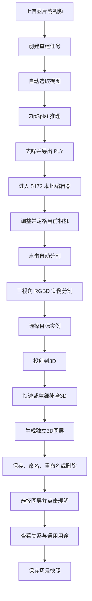

# ZipSplat 智能三维重建与语义编辑系统项目报告

## 摘要

本项目构建了一套本地运行的智能三维重建与语义编辑系统。系统接收多视角图片或视频，通过 ZipSplat 前馈模型生成 3D Gaussian Splatting 场景，并在浏览器内提供实时查看、语义实例分割、二维掩码到三维 Gaussian 的投射、几何补全、会话级语义图层和场景关系分析。

项目核心目标不是只生成可观看的三维模型，而是建立从“图像重建”到“对象级理解和编辑”的完整链路，使三维场景中的瓶子、杯子、椅子、床等对象能够被识别、选择、补全、分层和分析。

## 一、项目背景与目标

传统摄影测量和逐场景优化式 NeRF、3DGS 流程通常需要准确相机参数和较长优化时间。ZipSplat 使用少量未标定图片，通过单次前向推理直接预测 Gaussian 集合，适合快速本地重建。

原始重建结果仍是缺少对象语义的连续 Gaussian 集合。因此，本项目增加以下能力：

1. 图片或视频到 3D Gaussian 场景的自动重建。
2. 浏览器内实时查看和编辑 PLY 模型。
3. 基于当前相机视角进行自动实例分割。
4. 使用深度和多视角信息提高破损模型下的识别稳定性。
5. 将二维语义掩码准确投射到三维 Gaussian。
6. 对遮挡、破损和漏选区域进行受约束的三维补全。
7. 生成、保存、重命名和删除独立语义图层。
8. 基于用户定格视角分析所选对象的空间关系和通用用途。

## 二、系统总体架构

系统由三部分组成：

1. 应用前端：React、TypeScript、Vite，负责上传、任务状态、结果展示和进入编辑器。
2. 服务后端：FastAPI、Pydantic 和本地磁盘存储，负责任务调度、推理、分割、图层与快照接口。
3. 三维编辑器：基于 PlayCanvas SuperSplat 二次开发，负责 GPU 渲染、深度读取、Gaussian 投射、选择、撤销和图层操作。

## 三、三维重建技术路线

### 3.1 输入与任务管理

用户上传多视角图片或视频。后端校验文件后创建任务元数据，并写入本地磁盘任务队列。单 Worker 从队列中取任务，通过独立 Python 子进程执行重建。子进程结束后释放 PyTorch 模型及 GPU 显存，降低连续任务的显存残留风险。

输入图片超过默认数量时，系统自动筛选代表性视图。当前默认重建视图数为 6。

### 3.2 ZipSplat 前馈重建

ZipSplat 将多张未标定图片压缩为场景 token，再解码为数量较少的三维 Gaussian。该路线不要求用户提供相机外参、内参，也不执行逐场景迭代优化。

每个 Gaussian 主要包含：

1. 三维中心位置。
2. 三轴尺度。
3. 旋转四元数。
4. 透明度。
5. 球谐颜色特征。

重建结果导出为标准 3DGS PLY，并可转换为浏览器友好的 `.splat` 格式。

### 3.3 场景后处理

对象模式下，系统根据透明度阈值去除低贡献 Gaussian，并使用 DBSCAN 分析空间连通簇，保留主要对象簇。场景模式下采用更保守的透明度与离群点清理，避免删除有效背景结构。

当前主要参数包括：默认视图数 6，场景透明度阈值 0.02，最近邻离群比例 1%，Gaussian 尺度系数 1.0。

## 四、二维语义识别技术路线

### 4.0 移动相机实时预览

相机移动阶段使用 Objects365 YOLO26n 对 `640×360` 离屏截图进行低延迟检测，只显示类别框和置信度，不参与最终 mask 或三维图层生成。前端按 250 ms 节流，只允许一个请求在途；框通过同类别 IoU 匹配和指数平滑降低抖动，短暂漏检保留两帧，相机停止后延时清除。用户可通过左上角按钮关闭实时检测。

YOLO、Grounding DINO、SAM 2 和 ZipSplat 共享 GPU 协调器。用户点击“分割”后，系统阻止新 YOLO 帧，等待当前帧结束，再把 GPU 优先交给正式分割。服务启动时在后台预热 YOLO，实测同一设备首轮冷启动约 6.4 秒，预热后单帧约 134 ms。

### 4.1 当前相机视角定格

用户点击“分割”后，编辑器定格当前主相机，并捕获中心视角与两个辅助轨道视角。每个视角保存：

1. RGB 图像。
2. Float32 深度图。
3. View Matrix 与 Projection Matrix。
4. near、far、投影类型及捕获尺寸。

所有视图在对应相机姿态下重新执行 Gaussian 排序，避免透明 Gaussian 的渲染顺序与相机不一致。

### 4.2 自动实例分割

自动识别采用 Grounding DINO Tiny 与 SAM 2.1 Hiera Tiny 两级结构。Grounding DINO 根据文本类别提示输出开放词汇边界框和置信度，SAM 2.1 将边界框转换为像素级实例 mask。默认 `SEMANTIC_DETECTOR=auto`，优先使用本地 Grounding DINO；模型不可用时回退到 torchvision Mask R-CNN ResNet50 FPN V2，并继续使用 SAM 2.1 精修粗 mask。

当前提供 32 类室内对象提示：杯子、椅子、瓶子、床、沙发、电视、笔记本电脑、键盘、鼠标、手机、书、盆栽、花瓶、时钟、冰箱、微波炉、烤箱、水槽、马桶、餐桌、桌子、书桌、茶几、柜子、衣柜、床头柜、台灯、显示器、垃圾桶、门、窗、书架。`table`、`desk` 等桌类已经恢复识别。

Grounding DINO 默认框阈值为 0.30，文本阈值为 0.25，同类别非极大值抑制 IoU 阈值为 0.70。类别解析使用最长短语优先，避免 `table` 与 `dining table` 等包含关系造成误分类。SAM 输出还需通过框内像素比例、mask 与框面积比等质量门控。Mask R-CNN 回退路径使用 mask IoU 与面积比检查，精修失败时保留可用粗 mask。

多视角结果按类别和几何重投影重叠度执行一对一实例匹配。三视角模式下，实例通常需要至少两个视角支持。深度有效覆盖率不足的候选被过滤。为适配约 6 GB 显存设备，检测器与 SAM 预测器顺序加载，自动分割结束后主动释放 SAM 预测器和缓存。

### 4.3 交互式修正

编辑器已接入 SAM 2.1 点提示修正。正点表示目标内部，负点表示需要排除的区域；每次提示都会更新当前定格视图的 mask。后端维护单个 GPU 驻留分割会话，默认会话有效期为 10 分钟，并保存提示点、相机参数和最终 mask。

自动识别负责快速生成候选，点提示用于修复漏选、粘连和边界错误。两条路径共用后续多视角投射、三维补全和图层持久化流程。

## 五、二维掩码投射到三维 Gaussian

### 5.1 投射原理

二维 mask 本身只描述当前图像中的像素区域，不能直接成为三维图层。系统对每个 Gaussian 中心执行以下计算：

1. 使用 View Matrix 将世界坐标转换到相机坐标。
2. 使用 Projection Matrix 投影到图像像素。
3. 查询该像素是否位于语义 mask 内。
4. 将 Gaussian 相机深度与捕获深度图及其覆盖率比较。
5. 检查 Gaussian 透明度和有效状态。
6. 综合多个视角的可见正证据，生成 Gaussian 索引集合。

深度由透明 Gaussian 的加权表面估计得到，并同时保存像素覆盖率。覆盖率低于 0.08 的深度不参与可见性判断。深度门控用于区分目标表面、前景漂浮点和被遮挡点；遮挡、无有效深度及低覆盖率视图被视为未知证据，不直接作为反对票，从而降低破损模型和局部遮挡带来的误删。

### 5.2 GPU 实现

编辑器新增语义 mask、R32F 深度与 R32F 覆盖率相交着色器。mask 以红通道采样。GPU 为每个 Gaussian 输出状态位，包括 mask 命中、深度有效、可见、前置不一致、后置不一致和低透明度。融合规则把可见且命中 mask 作为正证据，把可见但位于 mask 外作为负证据，把遮挡和低可信深度作为未知证据。

多视角融合后只执行一次选择提交，并接入 SuperSplat 的 EditHistory 和 SelectOp，因此选择、分离、撤销和重做保持一致。

## 六、三维语义补全

二维投射只能覆盖已观测表面。为了恢复 mask 边缘、遮挡区和破损部分，项目实现两级补全：

### 6.1 浏览器快速补全

前端根据 Gaussian 的局部空间邻域、颜色、尺度和透明度扩展高可信种子。该步骤响应快，用于交互预览，并设置最多增加种子数量 25% 的保护上限。

### 6.2 后端精细补全

精细补全借鉴 Open3D 常见点云区域生长思想，核心选区使用 NumPy、SciPy `cKDTree` 和局部 PCA 实现；Open3D 仅在独立子进程中用于可选 TSDF/Mesh 生成：

1. 以多视角投射结果为高可信种子。
2. 用 KD 树建立局部近邻。
3. 通过 PCA 估计局部法向。
4. 同时约束空间距离、颜色差、尺度比、透明度和法向一致性。
5. 进行有限轮次区域生长。
6. 使用 25% 增长上限抑制扩张到相邻对象。

这种方案适合补全同一对象的局部缺口，但不能凭空生成重建数据中不存在的背面几何。

## 七、语义图层与会话存储

用户确认结果后，可将选中 Gaussian 从原 Splat 分离为独立三维图层。图层名称默认使用识别类别和实例序号，例如“瓶子1”，并允许后续重命名和删除。

后端保存以下数据：

1. 原始二维 mask。
2. 相机矩阵与捕获元数据。
3. 点击提示点。
4. 类别、中文名、实例序号和置信信息。
5. `uint32-le` Gaussian 索引 sidecar。
6. 源模型顶点数和资源校验信息。

浏览器只缓存未提交编辑状态。语义图层在当前页面会话期间暂存于 `data/layers/{task_id}/{layer_id}`，打开时清理上次残留，关闭或刷新时再清理。删除图层前显示影响确认，并级联处理引用该图层的场景快照；原始 PLY 不受影响。

## 八、场景理解与快照

用户点击“理解”后，系统只分析当前选中的已保存语义图层，并以点击时的当前相机为参考系。对象位置使用 Gaussian 中心的中位数和 5% 至 95% 分位边界计算，以降低离群点影响。

当前输出高可信空间关系：左侧、右侧、前方、后方、近邻和二维重叠。关系采用用户视角表达，例如“瓶子1位于杯子1的左前方”。系统不显示具体距离和置信度，也不判断物体间的上方、下方关系。

理解面板还显示固定的通用用途，例如瓶子用于盛装、储存和倾倒液体，床用于睡眠和休息。当前用途来自受控类别知识表，不是语言模型自由生成，因此结果稳定、可解释。

分析结果可保存为场景快照。快照自动命名为“视角分析1”等，允许重命名、删除、查看和恢复相机。场景图稳定后，可在该结构化数据之上接入自然语言问答。

## 九、完整用户流程

## 十、主要开源工具与作用

| 工具或框架 | 项目作用 | 许可证或注意事项 |
|---|---|---|
| ZipSplat | 少视图、无标定、前馈式 3DGS 重建 | 源码 Apache 2.0；预训练权重需单独核对使用条款 |
| PyTorch | 深度学习推理与 CUDA 张量计算 | BSD 风格许可证 |
| torchvision | Mask R-CNN 模型、COCO 权重和图像预处理 | BSD 风格许可证；权重条款需单独核对 |
| Ultralytics Objects365 YOLO26n | 相机移动时的低延迟目标框预览 | AGPL-3.0 或商业许可，发布方式必须单独审查 |
| Grounding DINO Tiny | 文本提示驱动的开放词汇目标检测 | Apache 2.0；模型权重条款需单独核对 |
| Hugging Face Transformers | Grounding DINO 模型加载与推理接口 | Apache 2.0 |
| SAM 2.1 | 检测框自动精修及正负点交互式实例分割 | Apache 2.0；模型权重条款需单独核对 |
| gsplat | Gaussian 渲染与 CUDA 加速 | Apache 2.0 |
| SuperSplat | 浏览器 3DGS 查看与编辑基础 | MIT |
| PlayCanvas Engine | WebGL/WebGPU 场景和渲染引擎 | MIT |
| React | 应用界面 | MIT |
| Vite | 前端开发服务器和构建 | MIT |
| TypeScript | 前端静态类型 | Apache 2.0 |
| FastAPI | REST API 和接口文档 | MIT |
| Uvicorn | ASGI 服务 | BSD |
| Pydantic | 请求与响应数据校验 | MIT |
| NumPy | 数值与矩阵处理 | BSD |
| SciPy | KD 树、线性代数和局部几何补全 | BSD |
| scikit-learn | DBSCAN 场景去噪 | BSD |
| OpenCV | 图像和视频处理 | Apache 2.0 |
| pycolmap | 几何与相机相关工具 | BSD |
| plyfile | PLY 读取与写出 | GPLv3，发布方式需重点复核许可证兼容性 |
| pytest | 后端自动化测试 | MIT |
| Ruff、Oxlint、ESLint | Python 与前端静态检查 | 各工具按其许可证使用 |

说明：源码许可证不自动覆盖模型权重和训练数据。当前 README 标记模型权重采用 CC BY-NC 4.0，意味着商业使用前必须进一步取得授权或替换权重。正式发布前应生成第三方软件清单和许可证归档。

## 十一、工程与安全设计

1. 大文件上传采用流式分块写盘，避免整体加载导致内存溢出。
2. Pydantic 严格校验相机矩阵、图片尺寸、深度字节数和 Gaussian 索引。
3. 深度数据拒绝 Inf、越界值和尺寸不一致输入。
4. GPU 协调器避免重建与分割同时抢占显存。
5. 任务状态落盘，服务重启后可恢复未完成任务。
6. CORS 使用显式来源白名单，不允许带凭证的任意来源。
7. 图层索引绑定源模型顶点数，降低跨模型误用风险。
8. 编辑操作进入统一历史队列，支持撤销和重做。
9. Service Worker 对编辑器核心资源采用更新策略，减少旧缓存导致功能不生效。

## 十二、测试与当前验证结果

项目已建立后端契约、CORS、文件管理、队列、重建配置、PLY 查看、格式转换、分割、几何补全和场景快照测试。

已完成的关键验证包括：

1. 最新后端完整回归为 73 项通过，覆盖重建配置、分割、实时检测 HTTP 契约、GPU 互斥、图层、快照和文件管理。
2. SuperSplat 编辑器生产构建通过。
3. 真实 PLY 浏览器冒烟测试通过，无页面错误、路由错误和 GLSL 编译错误。
4. 一次投射测试选择 1132 个 Gaussian，三维补全增加 18 个 Gaussian。
5. 独立图层创建后场景 Splat 数量由 1 增至 2，连续撤销后恢复为 1。
6. 场景理解定向测试得到 2 个对象和 3 条关系，并成功保存快照。
7. 实时检测浏览器测试完成移动触发、中文框、开关恢复和分割清框，页面无错误；YOLO 热推理约 134 ms。

上述数字属于当前测试样例，不代表所有场景的精度指标。正式评估仍需建立标注数据集并计算实例分割 AP、三维 IoU、完整率和误扩张率。

## 十三、当前局限

1. Grounding DINO 支持开放词汇，但当前界面仍使用 32 类受控提示白名单，尚未开放任意用户文本提示。
2. 增加文本类别不等于模型对每类都具有相同精度；床、沙发等大物体在破损重建视图中仍可能漏检，桌类之间仍可能混淆。
3. 三视角来自编辑器轨道相机，不等同于真实多相机采集，视差和背面信息有限。
4. 二维 mask 只能为已渲染表面提供证据，无法恢复模型中完全不存在的几何。
5. Gaussian 行索引在同一资源版本中稳定，但导出、压缩、重新排序或替换数据后不能作为永久全局 ID。
6. 当前场景理解使用确定性几何规则和固定用途知识，不包含开放式自然语言推理。
7. 本地单 Worker 和单 GPU 会限制并发任务数量。
8. 许可证和模型权重条款仍需在商业化前完成专项审查。

## 十四、下一阶段建议

### 第一阶段：建立量化评估

选取卧室、客厅、厨房、办公区等典型场景，标注二维实例 mask 和三维 Gaussian 真值。分别评估二维识别、多视角关联、三维投射和补全效果。

### 第二阶段：完善开放类别配置

在已完成的 Grounding DINO 与 SAM 2 链路上增加用户自定义文本类别、类别分组、同义词管理和分类别阈值。建立类别提示版本记录，保证同一项目能够复现识别结果。

### 第三阶段：构建稳定三维场景图

为语义对象建立跨导出稳定 ID，保存类别、几何包围体、视角可见性、对象关系和时间版本。将当前快照关系升级为可更新、可追踪的三维场景图。

### 第四阶段：接入问答

在稳定场景图上接入语言模型。语言模型只读取结构化对象与关系数据，不直接猜测像素或 Gaussian，从而回答“瓶子1在什么位置”“场景中有哪些可坐的物体”等问题，并保留证据来源。

### 第五阶段：工程化与发布

独立识别版已整理并发布至 GitHub 仓库 `arornkk-eng/Qg`。该版本包含识别后端、可导入任意 Gaussian PLY 的定制 SuperSplat 源码与生产构建、模型下载脚本和部署文档，不包含前期 ZipSplat 重建模块、模型权重、用户数据和 source map。后续继续增加任务取消、GPU 队列监控、错误恢复、性能基准、第三方许可证清单和可复现部署配置。

## 十五、结论

本项目已经完成从少视图图片到 3D Gaussian 场景、从开放词汇检测和精细二维 mask 到三维对象图层、再到视角相关空间关系分析的技术闭环。系统的关键价值在于把快速 3DGS 重建结果转化为可选择、可编辑、可保存和可理解的对象级数据。

现阶段重点是建立标注数据和量化指标，验证 32 类开放词汇提示、SAM 精修、多视角深度投射及几何补全在不同场景中的稳定性。在此基础上开放用户自定义类别，再建设稳定场景图和自然语言问答。
