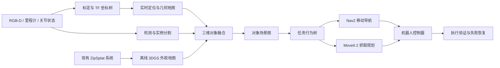

# 从三维建模、目标识别到机器人部署的实施方案

## 1. 方案结论

现有系统适合承担离线语义建图与对象资产生成，不能直接作为机器人实时避障和抓取系统。

机器人主链路必须使用真实 RGB-D、相机标定、实时定位、米制几何地图和碰撞检测。现有 3D Gaussian Splatting 系统保留为高质量外观地图与语义先验。

首个明确目标：

> 室内移动机械臂识别指定物体，导航到工作台，重新观测，生成抓取位姿，完成抓取和放置。



## 2. 当前系统与机器人需求差距

| 能力 | 当前状态 | 技术决策 |
|---|---|---|
| 快速三维重建 | ZipSplat 已具备 | 保留，作为离线建模能力 |
| 实时预览识别 | YOLO11n 已具备 | 替换为业务类别模型 |
| 精细实例分割 | Grounding DINO 与 SAM 2.1 已具备 | 保留为慢速高精度路径 |
| 二维到三维投影 | Gaussian 索引投影已具备 | 扩展到真实 RGB-D 点云 |
| 几何补全 | KDTree 局部增长已具备 | 仅用于显示，不用于碰撞安全 |
| 稳定对象 ID | 缺失 | 新建对象跟踪与版本系统 |
| 米制尺度 | 不稳定 | 使用 RGB-D、标定板或机器人运动约束恢复 |
| 实时定位 | 缺失 | 接入视觉惯性或激光 SLAM |
| 碰撞地图 | 缺失 | 建立 TSDF、OctoMap 或体素地图 |
| 抓取规划 | 缺失 | 接入 MoveIt 2 Task Constructor |
| 移动导航 | 缺失 | 接入 Nav2 |
| 机器人接口 | 缺失 | 使用 ROS 2 Jazzy |
| 安全闭环 | 缺失 | 增加独立安全层、超时、急停和速度限制 |

核心原则：Gaussian Splat 不能作为唯一碰撞几何。机器人决策必须使用具有真实尺度、误差边界和时间戳的几何数据。

## 3. 总体技术架构

系统划分为建模层、识别层、场景理解层、任务规划层、机器人执行层和安全运维层。

### 3.1 建模层

输入数据：

1. 环绕 RGB-D 视频。
2. 相机内参与深度尺度。
3. 相机到机器人基座的外参。
4. 机器人里程计或 SLAM 位姿。

系统并行生成两类地图：

1. 3DGS 外观地图，用于展示、语义标注和远距离候选搜索。
2. 米制几何地图，使用 TSDF、点云或 OctoMap，用于距离计算、导航、碰撞和抓取。

当前仓库已有 Open3D TSDF 原型，但三个邻近虚拟视角不足以生成机器人可用几何。正式方案应使用真实相机环绕采集 12 至 24 个有效视角，并融合真实深度。

统一建模产物：

```text
scene/
  gaussian.ply
  collision_map.bt
  surface_mesh.ply
  camera_calibration.yaml
  map_to_robot.yaml
  objects.json
  version.json
```

### 3.2 识别层

识别采用快慢双路径。

#### 快速路径

1. 使用 YOLO 检测或分割模型。
2. 目标速度为 10 至 30 FPS。
3. 用于机器人移动期间持续检测和跟踪。
4. 最终模型仅训练实际业务目标，不使用通用 32 类白名单作为生产方案。

#### 精确路径

1. Grounding DINO 产生候选目标。
2. SAM 2.1 生成精细实例 mask。
3. 使用 RGB-D 将 mask 投影到三维。
4. 执行多视角、多帧融合。
5. 在抓取前完成目标确认和位姿更新。

#### 稳定对象 ID

对象 ID 不能依赖 Gaussian 行索引。导出、压缩或重新排序都会破坏这种索引关系。

稳定 ID 使用以下信息进行数据关联：

1. 目标类别。
2. 三维质心和尺寸。
3. 外观嵌入特征。
4. 三维包围盒重叠率。
5. 时间连续性。
6. 观测来源和地图版本。

对象记录格式：

```json
{
  "object_id": "cup_0042",
  "class_id": "cup",
  "confidence": 0.93,
  "pose_map": {},
  "pose_covariance": [],
  "bbox_3d": {},
  "geometry_uri": "",
  "last_seen": "",
  "source_frames": [],
  "state": "confirmed"
}
```

### 3.3 场景理解层

场景理解层将检测结果转化为可查询、可追踪、可执行的对象场景图。

每个对象至少包含：

1. 稳定对象 ID。
2. 类别和置信度。
3. `map` 坐标系下的六自由度位姿。
4. 位姿协方差。
5. 三维包围盒和局部点云。
6. 支撑关系、邻近关系和包含关系。
7. 当前状态，例如可见、遮挡、已抓取或已放置。
8. 最后观测时间和数据来源。

场景图只能基于结构化感知结果进行推理。语言模型可以读取场景图，但不能直接代替几何测量、碰撞检测或安全判断。

### 3.4 执行层

ROS 2 工作区建议：

```text
robot_ws/src/
  zipsplat_scene_bridge
  object_perception
  object_fusion
  semantic_map_server
  grasp_pose_estimator
  manipulation_server
  task_orchestrator
  robot_bringup
  system_monitor
```

主要 ROS 2 接口：

| 类型 | 名称 | 数据或用途 |
|---|---|---|
| Topic | `/semantic_objects` | 对象 ID、类别、位姿和置信度 |
| Topic | `/collision_environment` | OctoMap 或体素碰撞地图 |
| Service | `/query_object` | 按类别和空间条件查询对象 |
| Action | `/inspect_object` | 移动相机并重新观测 |
| Action | `/pick_object` | 执行完整抓取事务 |
| Action | `/place_object` | 执行完整放置事务 |
| TF | `map → odom → base_link → camera_link` | 全链路坐标关系 |

MoveIt 2 Planning Scene 作为机械臂运动规划、碰撞检测和世界状态的中心。Nav2 负责移动底盘定位、路径规划、控制和恢复。

### 3.5 任务行为树

任务流程：

```text
查找对象
→ 判断置信度
→ 导航到观察位
→ 精确分割
→ 更新三维位姿
→ 生成抓取候选
→ 碰撞检查和逆运动学检查
→ 接近目标
→ 闭合夹爪或启动吸盘
→ 抬升
→ 验证抓取
→ 导航或移动到放置位
→ 放置
→ 更新对象状态
```

每个动作必须具有成功、失败、超时和取消状态。失败后进入重新观测、重新规划、安全撤离或人工接管分支。

## 4. 三维补全主链路

补全必须成为与识别并列的核心模块，不能停留在识别 mask 后扩大 Gaussian 选区。

当前系统中的两种能力边界如下：

| 当前能力 | 实际作用 | 无法解决的问题 |
|---|---|---|
| Gaussian 邻域扩张 | 从现有 Gaussian 中找回漏选部分 | 不能生成不存在的几何 |
| 图层 TSDF 网格化 | 将现有可见表面转换为 Mesh | 不能可靠恢复背面和遮挡结构 |

正式补全链路分为三个等级。不同等级的产物必须使用不同可信度，不得混用。

### 4.1 L1 观测补全

目标：补全已被传感器观测，但因识别漏选、遮挡或跨视角关联失败而缺失的表面。

输入：

1. 多视角 RGB-D。
2. 相机内外参。
3. 每个视角的实例 mask。
4. 原始 Gaussian、点云和可见性信息。

方法：

1. 将所有视角 mask 投影到统一三维坐标系。
2. 使用深度一致性和可见性区分正证据、负证据和未知区域。
3. 使用类别、颜色、尺度、法向和空间连通性执行区域增长。
4. 使用多视角投票抑制相邻物体误扩张。
5. 将新增部分写入独立图层，保留来源视角和置信度。

L1 只选择真实存在的观测数据，可以用于语义对象范围修正。若深度有效且误差达标，也可用于机器人碰撞几何。

### 4.2 L2 表面几何补全

目标：恢复轻度遮挡、孔洞和视角覆盖不足造成的局部缺面。

方法：

1. 对目标对象隔离后的 RGB-D 帧执行 TSDF 融合。
2. 对小孔洞使用受约束的 Poisson、BPA 或局部隐式表面修复。
3. 使用局部法向、曲率和对称性生成候选表面。
4. 将候选表面重新渲染到所有输入视角，检查轮廓、深度和 mask 一致性。
5. 删除与任一可靠观测冲突的补全面。

L2 产物可以用于展示、尺寸估计和抓取候选生成。进入碰撞地图时必须附加安全膨胀量，不能视为真实观测表面。

### 4.3 L3 生成式对象补全

目标：推断完全不可见的背面、大面积遮挡部分或严重残缺对象。

候选路线：

1. 点云补全网络，输入部分点云并输出完整点云。
2. 隐式 SDF 或 Occupancy 网络，预测完整对象表面。
3. 基于类别先验或 CAD 检索的形状拟合。
4. 生成多种候选形状，而不是只输出单一确定结果。

L3 输出属于推断几何，不属于观测事实。它可以用于下一最佳视角规划、抓取候选排序和数字资产展示，不得直接作为近距离安全碰撞边界。

### 4.4 统一补全数据结构

每个点、Gaussian、体素或 Mesh 面片需要携带来源和可信度：

```json
{
  "object_id": "cup_0042",
  "completion_level": "L2",
  "geometry_uri": "completed_mesh.ply",
  "observed_ratio": 0.68,
  "confidence": 0.82,
  "source_views": [2, 4, 7, 9],
  "uncertainty_uri": "uncertainty.bin",
  "safe_for_collision": false,
  "safe_for_grasp_proposal": true,
  "model_version": "surface-completion-v1"
}
```

场景中必须同时保存：

1. `observed_geometry`，传感器真实观测结果。
2. `completed_geometry`，算法推断或修复结果。
3. `uncertainty`，每个区域的不确定性。
4. `provenance`，数据来源、模型和版本。

### 4.5 补全验证闭环

补全不能只依赖视觉效果。验证方法：

1. 人工遮挡完整对象，使用部分观测生成补全结果。
2. 与未遮挡真值比较 Chamfer Distance、F-score 和体积 IoU。
3. 从留出视角重新渲染，计算轮廓 IoU、深度 RMSE 和法向一致性。
4. 统计补全增益、错误扩张率和不确定性校准误差。
5. 在仿真中验证补全前后抓取成功率变化。

首版门槛：

1. L1 漏选找回率不低于 85%。
2. L1 错误扩张率不高于 5%。
3. L2 留出视角轮廓 IoU 不低于 0.85。
4. L2 深度 RMSE 不高于对象包围盒对角线的 2%。
5. 补全后抓取成功率相对基线提升至少 10 个百分点。
6. 推断几何与观测几何发生冲突时，始终以真实观测为准。

### 4.6 推荐实施顺序

1. 先升级现有 Gaussian 邻域扩张，加入多视角证据、颜色、法向和类别约束，完成可靠 L1。
2. 将当前虚拟视角 TSDF 改为真实 RGB-D TSDF，完成对象级 L2。
3. 增加补全结果和原始结果的双层显示、置信度热图及撤销能力。
4. 建立遮挡模拟和定量评测集。
5. L1 与 L2 指标稳定后，再评估点云补全网络或 CAD 先验形成 L3。
6. 使用补全不确定性驱动机器人移动到下一最佳视角，优先主动观测，而不是持续猜测。

## 5. 抓取方案

第一版限定刚性桌面物体和一种夹爪，不直接追求任意物体通用抓取。

抓取位姿生成分为三层：

1. 规则方法。根据三维包围盒、主轴和表面法向生成候选，适合盒、瓶和杯等规则物体。
2. 学习方法。输入局部点云，输出六自由度抓取姿态和质量分数。
3. 混合过滤。模型生成候选，MoveIt 2 负责逆运动学、碰撞、接近、抬升和撤离验证。

抓取成功必须同时满足：

1. 夹爪宽度、夹持电流或吸盘压力处于有效范围。
2. 抬升后目标随末端执行器移动。
3. 原位置目标消失或显著移动。
4. 机器人无碰撞、超力矩和控制异常。

## 6. 部署方案

### 6.1 双计算节点

| 节点 | 职责 |
|---|---|
| 机器人端 Ubuntu 24.04 与 ROS 2 Jazzy | 相机、TF、定位、导航、控制、安全和轻量推理 |
| GPU 工作站 | ZipSplat、Grounding DINO、SAM 2、高质量重建和模型训练 |

机器人端可选 Jetson Orin。推理模型统一导出 ONNX，再转换为 TensorRT FP16 引擎。

当前 Windows Web 系统保留为管理台，不作为机器人实时控制主机。FastAPI 负责场景、任务和模型资产管理，ROS 2 Bridge 负责受控数据交换。

### 6.2 生命周期管理

机器人核心节点采用 ROS 2 Lifecycle：

```text
unconfigured → inactive → active → error
```

以下条件禁止节点进入 `active`：

1. 模型未正确加载。
2. 标定文件缺失或版本不一致。
3. TF 坐标树不完整。
4. 相机、里程计或关节状态超时。
5. GPU 推理服务异常。
6. 急停、安全门或限速状态异常。

### 6.3 性能降级

1. GPU 工作站不可用时，机器人继续使用本地 YOLO 和既有几何地图。
2. 精确分割不可用时，禁止执行低置信度抓取。
3. 定位质量下降时，停止导航并请求重新定位。
4. 深度数据异常时，禁止更新碰撞地图和抓取位姿。
5. 网络中断时，机器人端安全控制不受影响。

## 7. 数据与训练方案

### 7.1 数据集

首版限定 5 至 10 类业务物体。每类建议采集：

1. 500 至 1000 张检测图像。
2. 200 至 500 张实例分割图像。
3. 20 至 50 个完整 RGB-D 场景序列。
4. 不同光照、遮挡、距离、角度和背景。
5. 真实机器人相机数据优先于互联网图片。

数据划分必须按场景或物体实例划分，不能随机拆分相邻视频帧，否则会产生数据泄漏。

### 7.2 训练顺序

1. 建立现有 YOLO11n 和 Grounding DINO 基线。
2. 微调业务 YOLO 检测或分割模型。
3. 校准各类别置信度阈值。
4. 建立三维融合与对象跟踪评测。
5. 当规则抓取达到稳定上限后，再引入学习型抓取网络。

## 8. 实施阶段

| 阶段 | 周期 | 交付物 | 通过标准 |
|---|---:|---|---|
| P0 场景冻结 | 1 周 | 机器人、夹爪、相机和 5 至 10 类物体清单 | 单一任务定义完成 |
| P1 数据与评测 | 2 周 | 标注集、自动评测和基线报告 | 每次模型变更可复现 |
| P2 米制建图 | 2 周 | 标定、TF、RGB-D TSDF 和 3DGS 对齐 | 1 米距离误差小于 10 mm |
| P3 三维识别 | 3 周 | 多帧融合、稳定 ID 和对象数据库 | 三维中心误差小于 20 mm |
| P4 对象补全 | 3 周 | L1 观测补全、L2 表面补全和不确定性图 | 错误扩张率不高于 5% |
| P5 仿真执行 | 2 周 | ROS 2、MoveIt 2、Nav2 和行为树 | 仿真连续成功 50 次 |
| P6 真机抓取 | 3 周 | 抓取、放置、恢复和结果验证 | 标准物体成功率不低于 90% |
| P7 工程部署 | 2 周 | 容器、日志、监控、回滚和部署文档 | 连续运行 8 小时无崩溃 |

预计总周期 18 周。第 11 周形成包含补全的感知闭环，第 16 周左右形成真机 MVP。

## 9. 验收指标

| 模块 | 指标 |
|---|---|
| 重建外观 | PSNR、SSIM 和留出视角对比 |
| 几何 | 深度 RMSE、表面完整率和尺度误差 |
| 二维识别 | mAP50、Mask AP 和漏检率 |
| 三维识别 | 3D IoU、质心误差和姿态误差 |
| 三维补全 | Chamfer Distance、F-score、体积 IoU、错误扩张率和不确定性校准 |
| 对象跟踪 | IDF1 和 ID Switch 数量 |
| 导航 | 到达率、碰撞次数和定位丢失次数 |
| 抓取 | 首次成功率、最终成功率和平均耗时 |
| 系统 | P95 延迟、显存峰值和故障恢复时间 |
| 安全 | 急停响应、失联停车和速度限制有效性 |

首版验收门槛：

1. 目标检测召回率不低于 95%。
2. 抓取前目标中心误差不高于 15 mm。
3. 抓取姿态角误差不高于 8°。
4. 感知结果时间戳延迟不高于 200 ms。
5. 标准场景抓取最终成功率不低于 90%。
6. 任一关键传感器失联后 100 ms 内停止下发新运动。
7. 连续运行 8 小时无进程崩溃和不可恢复 GPU 错误。

## 10. 安全要求

AI 感知和任务规划不能替代机器人独立安全系统。

必须具备：

1. 硬件急停。
2. 关节位置、速度、力矩限制。
3. 工作空间和禁入区域限制。
4. 人员接近时的减速或停机策略。
5. 控制命令超时和看门狗。
6. 网络断开后的本地安全停车。
7. 每次动作前的碰撞场景版本检查。
8. 仿真、低速空载和带载测试三级上线流程。

## 11. 当前最优先任务

1. 冻结第一版机器人、夹爪、RGB-D 相机和任务场景。
2. 建立标注集与自动评测，停止依赖主观目测。
3. 接入真实 RGB-D 和手眼标定，建立米制坐标系。
4. 将现有二维 mask 投影扩展为 RGB-D 三维对象融合。
5. 建立稳定对象 ID 和 `objects.json` 场景图。
6. 建立观测几何、补全几何和不确定性三层数据结构。
7. 完成 L1 多视角观测补全和遮挡评测集。
8. 使用真实 RGB-D TSDF 完成 L2 对象表面补全。
9. 新建 ROS 2 Bridge，先在仿真环境完成完整闭环。
10. 接入 MoveIt 2 和 Nav2。
11. 完成 TensorRT、容器化、监控和真机调优。

## 12. 关键风险

| 风险 | 影响 | 控制措施 |
|---|---|---|
| 3DGS 不具备稳定米制几何 | 抓取和碰撞判断错误 | 采用真实 RGB-D 几何主链路 |
| 单 GPU 模型竞争 | 延迟和显存溢出 | 快慢模型分层，重模型放工作站 |
| 业务数据不足 | 漏检和误抓 | 先限定类别和场景，建立闭环采集 |
| Gaussian 索引变化 | 对象 ID 丢失 | 使用独立对象数据库和版本号 |
| 网络中断 | 任务停滞或危险 | 安全控制留在机器人本地 |
| 开放词汇模型误识别 | 错误抓取 | 抓取前重新观测和几何验证 |
| 生成式补全产生虚假结构 | 碰撞或抓取失败 | 分离观测与推断几何，按不确定性限制用途 |
| 第三方许可限制 | 无法商业部署 | 商业化前完成专项许可证审查 |

## 13. 许可审查

当前 ZipSplat 权重注明 CC BY-NC 4.0，存在商业用途限制。商业化前必须审查：

1. ZipSplat 模型权重与训练数据许可。
2. Grounding DINO 代码和权重许可。
3. SAM 2.1 代码和权重许可。
4. YOLO 代码、权重与部署方式许可。
5. SuperSplat、Open3D、ROS 2 和其他第三方依赖许可。
6. 自采数据中的个人信息、场地和物体知识产权。

许可证审查未完成前，系统只应作为研究和内部验证原型。

## 14. 参考资料

1. [MoveIt 2 Planning Scene](https://moveit.picknik.ai/main/api/html/planning_scene_overview.html)
2. [MoveIt 2 Planning Scene Monitor](https://moveit.picknik.ai/main/doc/concepts/planning_scene_monitor.html)
3. [MoveIt Grasps](https://moveit.picknik.ai/main/doc/examples/moveit_grasps/moveit_grasps_tutorial.html)
4. [Nav2 Behavior Trees](https://docs.nav2.org/behavior_trees/)
5. [Nav2 Concepts](https://docs.nav2.org/concepts/)
6. [ROS 2 Jazzy Lifecycle](https://docs.ros.org/en/ros2_packages/jazzy/api/launch_ros/launch_ros.actions.html)
7. [NVIDIA TensorRT Installation Guide](https://docs.nvidia.com/deeplearning/tensorrt/archives/tensorrt-1020/pdf/TensorRT-Installation-Guide.pdf)
